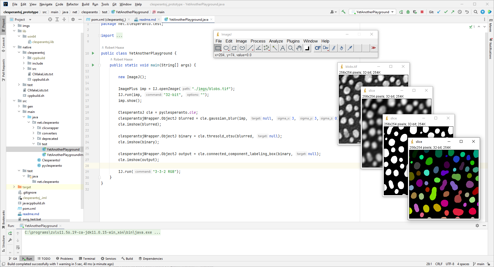

## Preliminary build instructions

Please note this project is in very early stages.
It is expected these build instructions will change and become more robust as the project evolves.
The current build instructions are for early adapters to test and give us feedback.  Where things need improvement we've added notes and are very happy to get feedback.

## pre-requisites
### Install a c++ compiler

For windows look at the [CLIc_prototype windows build guide](https://github.com/clEsperanto/CLIc_prototype/blob/master/docs/windows_build/windows_build.md) and install Microsoft Build tools (or Visual Studio Community edition) as explained [here](https://biapol.github.io/blog/robert_haase/ms_build_tools/). 
Hint: during installation, activate Windows C++ development.

### Install OpenCL

Note.  As we create builds for different operating systems these instructions may change.

Currently we have only built on Windows using the Nvidia distribution of OpenCL version 11.2

The OpenCL include and lib folders are defined [here](https://github.com/clEsperanto/clesperantoj_prototype/blob/javacpp/src/main/java/net/clesperanto/clicwrapper/clesperantoj.java#L17)

Add the folder where "cl.exe" lives to the PATH, e.g. this one:

```
C:\Program Files (x86)\Microsoft Visual Studio\2019\BuildTools\VC\Tools\MSVC\14.29.30133\bin\Hostx64\x64
```

Follow the instructions to build [CLIc](https://github.com/clEsperanto/CLIc_prototype/blob/master/docs/windows_build/windows_build.md). 
Make sure when setting up CMAKE, that it is built into this directory as explained [here](https://github.com/clEsperanto/CLIc_prototype/blob/master/docs/windows_build/windows_build.md).

```
../CLIc_prototype/build/
```

### Java Development Kit

Download and install a Java-Development-Kit (JDK), preferably version 11, e.g. from [azul](https://www.azul.com/downloads/?package=jdk#download-openjdk).

Set the environment variable JAVA_HOME to a valid SDK, e.g.:

```
setx JAVA_HOME C:\Users\rober\.jdks\azul-11.0.14.1\
echo %JAVA_HOME%
```

### Maven

Download [apache-maven](https://maven.apache.org/download.cgi), unzip it and make it part of PATH:

```
C:\programs\apache-maven-3.8.4-bin\apache-maven-3.8.4\bin
```

### git

Install [git-scm](https://git-scm.com/downloads) and add it to the PATH so that `bash` can be called from any command line.

### cmake

Download and install [cmake](https://cmake.org/download/).

### CLIc_prototype

Get [CLIc_prototype](https://github.com/clEsperanto/CLIc_prototype) and put code in the same directory as ```clesperantoj_prototype```.

Build and install using ```CLIc_prototype/build``` as the folder to place the build files generated by cmake 
and ```CLIc_prototype/bin``` as the installation folder where the binaries will be placed.  
It is important to use this code and installation folder as ```clesperantoj_protyotype``` uses them as include and link paths.

If using the cmake windows GUI and Visual Studio GUI

1. Project Build files are specified by changing the 'Where to build the binaries' option on the CMake GUI.
2. The installation folder is specified by the CMAKE_INSTALL_PREFIX option in the options table. This should be for example:
```
C:/structure/code/CLIc_prototype/bin
```

If using cmake from command line you need to use a bash prompt embedded in the x64 Native Tools command prompt.

Open the x64 Native Tools Command Prompt for VS 2019 (64 bit!), then run 'C:\Program Files\Git\bin\sh.exe' (optionally add 'C:\Program Files\Git\bin\' to windows path and then just type sh), then navigate to the root directory of this project and run

```
cmake -S . -B ./build -D CMAKE_INSTALL_PREFIX=/path/to/installation/folder
cmake --build ./build --parallel 10 --target install
```

You can modify installation location using -D CMAKE_INSTALL_PREFIX=/path/to/installation/folder

## Build clesperantoj_prototype

Open the x64 Native Tools Command Prompt for VS 2019 (64 bit!), navigate to the root directory of this project and run

```
mvn
```

## Running the prototype

After the build succeeded, you can run the main functions in [this package](https://github.com/clEsperanto/clesperantoj_prototype/tree/main/src/main/java/net/clesperanto/test) and play with clesperantoj. 
This is recommended to do from an IDE such as IntellIJ by clicking on the green triangle next to the main function:



## Trouble shooting

* Take a look at the ```javacpp``` section of the poml.xml and make sure the ```includePath``` and ```linkPath``` locations exist on your machine.

* Sometimes we had to make a trivial change to [clesperantoj][https://github.com/clEsperanto/clesperantoj_prototype/blob/javacpp/src/main/java/net/clesperanto/clicwrapper/clesperantoj.java], like adding a space, to activate the parser that generated the java wrapper.)

* In some cases, the build fails when executed the first time. 
You find a potential workaround explained [here](https://github.com/clEsperanto/clesperantoj_prototype/issues/4#issuecomment-1184768674).

## Acknowledgements
This project was supported by the Deutsche Forschungsgemeinschaft under Germany’s Excellence Strategy – EXC2068 - Cluster of Excellence "Physics of Life" of TU Dresden.
This project has been made possible in part by grant number [2021-237734 (GPU-accelerating Fiji and friends using distributed CLIJ, NEUBIAS-style, EOSS4)](https://chanzuckerberg.com/eoss/proposals/gpu-accelerating-fiji-and-friends-using-distributed-clij-neubias-style/) from the Chan Zuckerberg Initiative DAF, an advised fund of the Silicon Valley Community Foundation.
